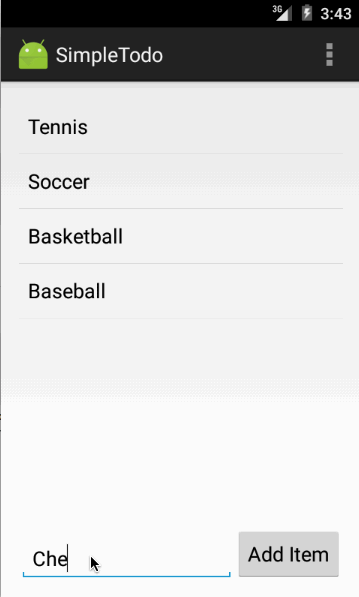

# SimpleToDo
[Android Bootcamp] Project 0 - Todo

This is an Android demo application for managing To Do list. 

Time spent: 2 hours spent in total

Checklist:

 * [x] Required: successfully add and remove items
 * [x] Required: editing todo items
 * [x] Required: persist todo items (remove, edit, add items) and retrieve them properly on app restart

Walkthrough of all user stories:

GIF created with [LiceCap](http://www.cockos.com/licecap/).
